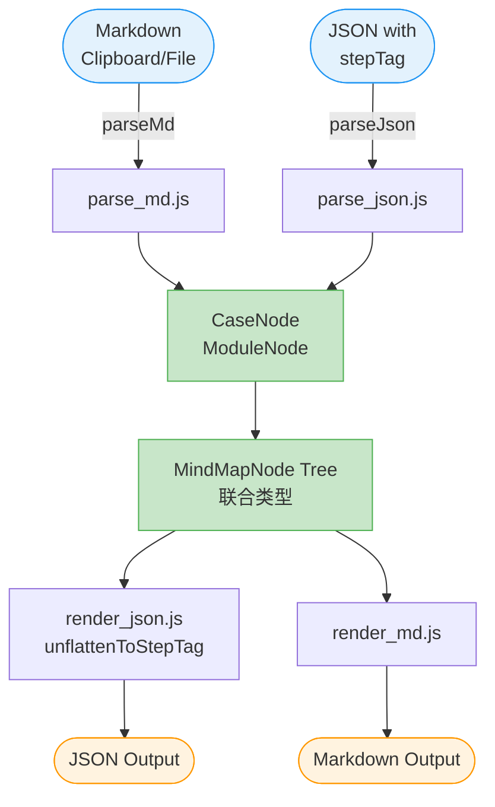

# 技术方案：Markdown与思维脑图JSON互转工具

## 1. 引言

本技术方案旨在描述一个用于Markdown文本与特定思维脑图应用JSON数据结构之间进行无损转换的工具。该工具主要面向测试工程师，解决AI生成测试用例文本与现有思维脑图工具格式不兼容的问题，实现测试用例的快速导入与导出。

## 2. 背景与动机

在日常测试工作中，测试工程师常使用在线思维脑图工具来编写和管理测试用例。随着人工智能技术的发展，利用AI辅助生成测试用例的需求日益增长。然而，通用AI生成的文本通常不符合思维脑图工具的特定数据结构，导致无法直接导入或需要大量手动调整。为了提高效率，本工具旨在提供一个解决方案，实现AI生成的Markdown格式测试用例与思维脑图JSON格式之间的自动化、无损互换。

## 3. 功能需求

- **核心转换功能**：
  - 将符合特定格式的Markdown文本转换为思维脑图应用的JSON数据结构。
  - 将思维脑图应用的JSON数据结构转换为符合特定格式的Markdown文本。
- **输入/输出方式**：
  - 通过剪切板进行JSON数据的输入和输出。
  - 通过剪切板进行Markdown文本的输入和输出。
  - 通过文件进行Markdown文本的输入和输出。
- **BOM处理**：
  - 剪切板输入的JSON数据，自动处理前缀 `[0xef, 0xbf, 0xbf, 0xef, 0xbb, 0xbf];`。
  - 输出到剪切板的JSON数据，自动带上该前缀。
- **易用性**：
  - 工具最终应打包成单个HTML文件，方便部署和使用。

## 4. 数据结构

### 4.1. 脑图的Markdown格式

Markdown格式旨在清晰地表示测试用例的层级和详细信息。

- **模块标题**：使用二至三级标题表示，分别对应一级模块和二级模块。
  - `## 一级模块名称`
  - `### 二级模块名称`
- **分类标题**：使用四至五级标题表示。
  - `#### 功能分类名称`
- **用例标题**：使用六级标题表示，清晰描述测试场景。
  - `###### 测试用例标题`
- **可见元数据**（直接显示在标题下方）：
  - `优先级: [S/A/B/C/D]`
  - `用例类型: [客户端/服务端/后台/前端，多个用逗号分隔]`
  - `自动化: [自动化暂未实现]` (可选)
  - `标签: [iOS,Android]` (可选，多个用逗号分隔)
- **隐藏元数据**（放在HTML注释中）：
  - `<!-- id: [string] -->`
  - `<!-- expandState: [string] -->`
  - `<!-- moduleType: [number] -->`
  - `<!-- moduleId: [number] -->`
  - `<!-- case: [array<number>] -->`
  - `<!-- aiCaseFlag: [boolean] -->`
- **前置条件**：
  - 使用加粗标题：`**前置条件**`
  - 使用无序列表表示多个条件，每个条件以短横线开头。
    ```md
    **前置条件**

    - 条件1
    - 条件2
    ```
- **测试步骤**：
  - 使用加粗标题：`**测试步骤**`
  - 使用表格格式，左列为操作步骤，右列为预期结果。
    ```md
    **测试步骤**
    | 操作步骤 | 预期结果 |
    |----------|----------|
    | [步骤1] | [结果1] |
    | [步骤2] | [结果2] |
    ```

### 4.2. 脑图的JSON格式

JSON数据结构是一个包含单个根对象的JSON数组，每个节点包含 `data` 对象和 `children` 数组，形成层级结构。

- **节点结构**：
  ```json
  {
    "data": {
      /* 节点属性 */
    },
    "children": [
      /* 子节点数组 */
    ]
  }
  ```
- **`data` 对象字段**：

| 字段名      | 数据类型        | 是否可选 | 含义说明                                                 |
| ----------- | --------------- | -------- | -------------------------------------------------------- |
| id          | string          | 可选     | 节点唯一标识                                             |
| text        | string          | 必填     | 节点主要内容或标签                                       |
| expandState | string          | 可选     | 节点展开/折叠状态                                        |
| aiCaseFlag  | boolean         | 可选     | AI用例标志                                               |
| moduleType  | number          | 可选     | 模块分级：1=一级模块，2=二级模块                         |
| moduleName  | string          | 可选     | 模块名称（已含在text中）                                 |
| moduleId    | number          | 可选     | 模块唯一编号                                             |
| priority    | number          | 可选     | 优先级：1=S，2=A，3=B，4=C，5=D                          |
| stepTag     | number          | 可选     | 步骤标记：1=测试用例，2=前置条件，3=操作步骤，4=预期结果 |
| starTag     | number          | 可选     | 自动化标记：1=自动化暂未实现                             |
| caseTag     | array\[obj]     | 可选     | 标签数组，展示name而非id                                 |
| owningSide  | array\[numbers] | 可选     | 用例类型：0=客户端，1=服务端，2=后台，3=前端             |
| case        | array\[numbers] | 可选     | 用例编号数组                                             |

### 4.3 中间层 MindMap Object（新增）

为在「通用脑图树」与「测试用例语义」之间取得平衡，中间层采用**联合类型**表示节点：

```ts
// mindmap_types.ts
export interface BaseNode {
  id?: string;
  text: string;
  expandState?: "collapse" | "expand";
  aiCaseFlag?: boolean;
}

export interface ModuleNode extends BaseNode {
  type: "module";
  moduleType: 1 | 2; // 1=一级模块 2=二级模块
  moduleId?: number;
  children: MindMapNode[]; // 可继续挂子模块或用例
}

export interface CaseNode extends BaseNode {
  type: "case";
  priority: 1 | 2 | 3 | 4 | 5; // S=1..D=5
  owningSide: number[]; // 0客户端 1服务端 2后台 3前端
  case: number[]; // 用例编号数组
  caseTag: { id: number; name: string }[];
  precondition: string[]; // 前置条件文本行
  steps: Array<{ action: string; expect: string }>;
  starTag?: number; // 自动化标记：1=自动化暂未实现
  // 不再维护 children，渲染时动态生成
}

export type MindMapNode = ModuleNode | CaseNode;
```

> 说明
>
> 1. `CaseNode` 把原“子节点”中的前置条件、步骤表格聚合为**强类型字段**，解析/渲染阶段无需再依赖 `stepTag`。
> 2. 树形结构仅由 `ModuleNode.children` 保持，与外部 JSON 的层级保持一一对应。
> 3. 双向转换时，只有 `parse_json.js` 和 `render_json.js` 需要做一次“拆/装”；其余业务代码可直接访问语义字段。

## 5. 数据映射与配置

为了确保数据转换的灵活性和可维护性，所有需要映射的字段（如优先级、用例类型、自动化状态、标签、模块类型）都将通过 `config.ts` 文件进行管理，以 TypeScript 常量对象的形式存在，避免硬编码的同时利用类型检查。

- `priority_mapping`: 优先级 S/A/B/C/D 到 1/2/3/4/5 的映射。
- `owning_side_mapping`: 用例类型 0=客户端，1=服务端，2=后台，3=前端 的映射。
- `star_tag_mapping`: 自动化标记 1=自动化暂未实现 的映射。
- `case_tag_mapping`: 标签名称到ID的映射。
- `module_type_mapping`: 模块标题到模块类型的映射。
- `metadata_keywords`: Markdown中可见元数据关键字到JSON字段的映射。
- `section_titles`: Markdown中前置条件和测试步骤的标题。
- `step_tag_mapping`: 步骤标记名称到数字的映射。

## 6. 转换规则

### 6.1 Markdown 转中间对象（节选）

1. 遇到六级标题 (`######`) 即视为用例节点，触发 `CaseNode` 解析模式。
2. 在同级别后续行中：
   - 可见元数据行（`优先级: X` …）→ 填入对应字段。
   - `**前置条件**` 标题下的无序列表 → 聚合为 `precondition: string[]`。
   - `**测试步骤**` 标题下的表格 → 按行拆成 `steps: [{action, expect}]`。
3. 解析完成后生成 `CaseNode`，**不再为其创建子节点**；后续同级标题若未出现更高阶模块标题，则继续当作同级用例处理。
4. 若解析失败（缺失必填字段、表格格式非法），立即抛出 `ParseError` 并给出行号，避免静默丢失。

### 6.2. JSON转Markdown (`json2md`)

- **默认值处理**：同上，如果JSON中可选字段不存在，则在Markdown中不生成对应的HTML注释或可见元数据。
- **数据映射查找不到**：如果通过配置文件查找不到对应的映射值，应记录警告信息，并跳过该字段继续渲染。
- **未定义的格式**：同上，对于JSON中不符合规定格式的内容，应忽略并跳过。
- **错误处理**：当输入的JSON结构不符合预期（如缺少必需的 `data` 或 `text` 字段）时，工具应抛出清晰的错误，并中止转换过程。

## 7. 架构设计

该工具采用模块化设计，主要由以下几个核心模块组成：

- **`main.js`**：主入口文件，负责协调整个转换流程。它根据输入类型（JSON/MD）和输出类型（JSON/MD），调用相应的解析器和渲染器。同时，它处理剪切板和文件I/O的抽象层。
- **`parse_json.js`** 新增 `flattenStepTag(tree): MindMapNode[]`  
  把带 `stepTag` 的原生 JSON 拆成 `ModuleNode | CaseNode` 联合结构。

- **`render_json.js`** 新增 `unflattenToStepTag(root): RawJsonNode[]`  
  把 `CaseNode` 重新展开成“子节点+stepTag”形式，供脑图工具消费。

- **`parse_md.js`** / **`render_md.js`** 彻底移除 `stepTag` 相关分支，直接读写 `CaseNode.precondition / steps` 字段。

- **`mindmap_types.js`**：定义了 `BaseNode`, `ModuleNode`, `CaseNode`, `MindMapNode` 等 TypeScript 类型定义，确保数据结构的一致性和类型安全。
- **`config.ts`**：以 TypeScript 常量对象的形式提供所有数据映射和关键字常量，利用类型系统保证配置的正确性。

### 转换流程示意图（Mermaid）



> 图例：
>
> - 蓝色=输入源
> - 绿色=中间 MindMap Object（联合类型）
> - 橙色=输出目标

## 8. 使用示例

以下是一个JSON到Markdown的转换示例：

**JSON输入**：

```json
[
  {
    "data": {
      "id": "e0e9ba83-dc21-4ccc-9ca5-bab935ac182c",
      "text": "客户端边界场景 - 安卓设备未安装App，点击短链跳转浏览器",
      "priority": 4,
      "stepTag": 1,
      "owningSide": [0],
      "case": [17789236],
      "aiCaseFlag": false,
      "caseTag": [
        { "id": 1388, "name": "iOS" },
        { "id": 1389, "name": "Android" }
      ]
    },
    "children": [
      {
        "data": {
          "id": "ca53f57e-18d1-407d-93cd-40f92fc4ea61",
          "text": "1. 安卓设备\n2. 未安装App\n3. 短信中包含有效短链（例如https://c.opdwz.cn/oppoppstore/ZaomjJx3kO）",
          "stepTag": 2,
          "aiCaseFlag": false
        },
        "children": []
      },
      {
        "data": {
          "id": "70e18ac8-a4e9-4029-8d8a-fd7c50414277",
          "text": "1. 在短信应用中点击短链",
          "stepTag": 3,
          "aiCaseFlag": false
        },
        "children": [
          {
            "data": {
              "id": "3423041f-ff67-4eb8-954f-acae068424f9",
              "text": "1. 跳转浏览器打开H5页面（对应长链内容）\n2. 不会尝试唤醒App",
              "stepTag": 4,
              "aiCaseFlag": false
            },
            "children": []
          }
        ]
      }
    ]
  }
]
```

**转换后Markdown输出**：

```md
###### 客户端边界场景 - 安卓设备未安装App，点击短链跳转浏览器

<!-- id: e0e9ba83-dc21-4ccc-9ca5-bab935ac182c -->
<!-- case: [17789236] -->
<!-- aiCaseFlag: false -->

优先级: C  
用例类型: 客户端  
标签: iOS, Android

**前置条件**

- 安卓设备
- 未安装App
- 短信中包含有效短链（例如https://c.opdwz.cn/oppstore/ZaomjJx3kO）

**测试步骤**

| 操作步骤             | 预期结果                                                |
| -------------------- | ------------------------------------------------------- |
| 在短信应用中点击短链 | 跳转浏览器打开H5页面（对应长链内容）<br>不会尝试唤醒App |
```

## 9. 性能要求

目前对工具没有特定的性能要求。主要目标是实现功能的正确性和易用性。

## 10. 现代工程化架构路线

### 10.1. 先想清楚“单文件”的技术约束

| 开发期爽点                                   | 运行期（单 HTML）限制                                                                                                                |
| -------------------------------------------- | ------------------------------------------------------------------------------------------------------------------------------------ |
| npm 生态、TypeScript、Vue/React、jest/vitest | 最终只能吐出：<br>① 一段 HTML<br>② 内联 CSS<br>③ 内联 JS（含 Source Map 可选）<br>④ 内联小图标（base64/svg）<br>⑤ **无静态资源请求** |

→ 所有“工程化红利”必须发生在**构建阶段**，运行时零依赖。

### 10.2. 总体架构：「两段三层」

```
┌-------------------- 开发期 --------------------┐
  ① View 层（Vue/React/Svelte 任选）
  ② Core 层（纯 TS，零 DOM，零框架）
  ③ Adapter 层（clipboard / file / drag-drop）
└----------------------------------------------┘
        │  pnpm build  (vite-plugin-singlefile)
        ▼
┌------------------ 交付物 --------------------┐
  单个 index.html（< 1 MB 可接受）
└----------------------------------------------┘
```

- **Core 层** = 纯领域模型 + 纯函数解析/渲染，**不依赖任何 UI 框架** → 可独立单元测试、可被其他语言直接移植。
- **Adapter 层** = 把“clipboard、file input、drag-drop”全部转成 `string` 扔给 Core，再把 Core 吐出的 `string` 写回 clipboard 或触发下载。
- **View 层** = 纯粹的数据入口 + 按钮 + 日志面板，逻辑厚度 < 5 %。

### 10.3. 目录骨架（monorepo 单包即可）

```
mindmap-converter/
├─ packages/
│  ├─ core/          → 领域模型 + parse/render，纯 TS，零依赖
│  ├─ adapter/       → clipboard, file, url-search-params 读写
│  └─ ui/            → Vue 组件（或 React/Svelte）
├─ tests/            → 与 core 并列，jest/vitest 直接测纯函数
├─ vite.config.ts
└─ index.html        → 最终单文件的“模板壳”
```

### 10.4. 关键技术选型与理由

| 维度       | 选型                                               | 理由                                      |
| ---------- | -------------------------------------------------- | ----------------------------------------- |
| 构建工具   | **Vite**                                           | 秒级冷启，插件生态成熟                    |
| 单文件插件 | **vite-plugin-singlefile**                         | 一行配置即可把 JS/CSS/PNG 全部内联        |
| UI 框架    | **Vue 3**（< 40 kB gzip） or **Svelte**（< 20 kB） | 体积小、编译期擦除，适合单文件            |
| Core 语言  | **TypeScript** 严格模式                            | 联合类型可完美表达 `ModuleNode｜CaseNode` |
| 测试       | **Vitest**（同 vite 生态）                         | 跑在 esbuild，秒级单测                    |
| 代码质量   | **eslint + prettier + tsc --noEmit**               | CI 门禁                                   |
| 包管理     | **pnpm**                                           | 快、省盘、workspace 一键拆包              |

### 10.5. 依赖倒置：让“单文件”成为构建产物，而非开发枷锁

- **开发期**正常 import npm 包（如 `js-yaml`、`file-saver`），写 `.vue`、写 `.scss` 都行。
- **构建期** vite-plugin-singlefile 会把：
  - 所有 `import` 打成单 JS 并内联；
  - 所有 `url(/assets/xx.svg)` 转成 base64；
  - 所有 CSS 提取后内联到 `<style>`；
  - 最终只剩一个 `dist/index.html`（通常 300~600 KB gzip）。

### 10.6. 运行时 Boot 流程（生成的单文件内部）

```html
<!doctype html>
<html>
  <head>
    <meta charset="utf-8" />
    <title>Markdown ↔ MindMap Converter</title>
    <style>
      /* 内联全部 CSS */
    </style>
  </head>
  <body>
    <div id="app"></div>
    <script type="module">
      // 内联全部 JS（含 Vue/Core/Adapter）
      const { createApp } = window.Vue;
      createApp({
        setup() {
          // 只有 20 行胶水代码：按钮点击 → adapter.read() → core.convert() → adapter.write()
        },
      }).mount("#app");
    </script>
  </body>
</html>
```

### 10.7. 可扩展性预留（未来可能的需求）

| 需求                | 如何接入                                                          |
| ------------------- | ----------------------------------------------------------------- |
| 黑暗模式            | UI 层用 CSS 变量，构建后仍内联                                    |
| 多语言              | core 层文案抽 `i18n/` 目录，vite 插件可内联 json                  |
| 撤销/重做           | core 层暴露 `convert(state): newState`，UI 层套 `useReducer` 即可 |
| PWA（离线）         | 再加 `vite-plugin-pwa`，一次配置即可                              |
| 嵌入 Electron/Tauri | 直接 `import core from '@mindmap/core'` 复用，0 改动              |

### 10.8. 开发 → 交付 一键命令

```bash
# 安装
pnpm i

# 开发
pnpm dev       # localhost:5173，热更新 < 300 ms

# 单测
pnpm test      # vitest  watch 模式

# 打包成单 HTML
pnpm build     # 产物 dist/index.html 唯一文件，双击即可用

# 验证单文件
pnpm serve dist # 本地 http 验证，大小、控制台无 404 即可
```

### 10.9. 小结：3 句话记住

1. **“单文件”是构建产物，不是开发枷锁**——用现代工程化写，用 vite-plugin-singlefile 收。
2. **Core 层保持 0 依赖 + 纯函数**→ 最易测、最易移植、最易设计。
3. **UI/Adapter 仅做数据入口+胶水**→ 今天 Vue，明天 React，后天 WebComponent，都可以随时换，而不碰业务核心。
